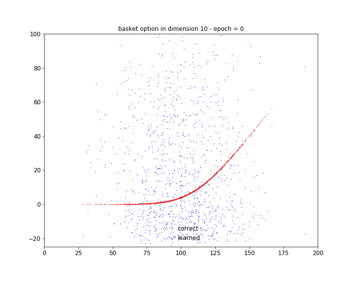

# Machine Learning in Finance:
# Python -- TensorFlow 1.x notebooks

 Notebook 1 Deep Learning Black & Scholes 

 Notebook 2:Deep Learning Basket Options 

The notebooks are also accesssible on Google colab, where they may run directly, in the cloud (but still on GPU) without any installation: https://antoinesavine.com/2019/11/01/deep-learning-derivatives-pricing/

